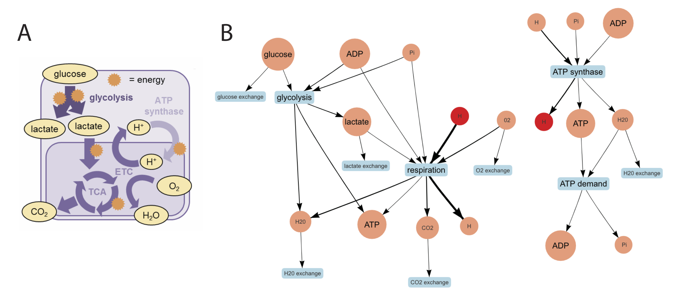

```{r setup, include=FALSE}

library(tidyverse)
library(reticulate)
library(knitr)

knitr::opts_chunk$set(echo = TRUE)

```

<style>
body {text-align: justify}
</style>

Biological modeling is currently a niche technique, the way that flow cytometry, microfluidics, and even microscopy once were. However, like flow cytometry, microfluidics, and microscopy, computational modeling is a powerful technique and well-suited to address many biological questions. Modeling approaches, such as genome-scale metabolic modeling, highlight knowledge gaps, generate high-confidence data-driven hypotheses, and contextualize sparse data. Genome-scale metabolic reconstructions are built from genomic data and by inferring function to complete or connect metabolic pathways; these reconstructions are supplemented with data from functional genetic and biochemical studies. These reconstructions represent our best understanding of an organism’s biochemistry and cell biology, and failed predictions illuminate knowledge gaps or unappreciated experimental complexities. A model can be viewed as a framework for storing thousands of hypotheses, such as hypotheses about gene-protein-reaction associations or enzyme function, as well as rigorously evaluating and documenting these hypotheses.

However, at least basic programming is necessary to use most computational tools, including metabolic models. Thus, learning to program is a major obstacle to obtaining the technical knowledge required to understand if metabolic modeling is the right approach to address your biological question of interest. Accordingly, usage of metabolic modeling is limited to researchers who feel comfortable with programming. 

We developed a tool, named metaboLITE, to decouple learning to program and learning about genome-scale metabolic modeling. metaboLITE is a web-based application that visualizes and implements two simple reconstructions (iSIM in **Figure \ref{fig:figure1}**) and an analytic framework used to analyze metabolic reconstructions (**Box 1**). 

```{r figure1, echo = FALSE, fig.cap="\\label{fig:figure1} iSIM represents mitochondrial metabolism (A). This can also be represented as a network (B) with metabolites in circles and reactions as arrows connect the metabolites. Reactions are named in boxes. This model includes 10 metabolites, 9 reactions, and 9 genes. Panel A adapted from iSIM REFRENCE. ETC = electron transport chain, TCA = tricarboxylic acid cycle.", out.width="75%", fig.align='center'}



```

Importantly, metaboLITE is presented from a biologist’s point of view. With metaboLITE, the user can perform three *in silico* experiments: (1) changing growth media, (2) knocking out genes, and (3) under/overexpressing enzymes. This simple shift in language retains all precision and accuracy of the technical details but is approachable to biologists. 

## Using metaboLITE {-}

We recommend readers first visit **iSIM paper ref**, linked *here* as this manuscript builds on the ideas presented there.

\setlength{\fboxsep}{1em}
\noindent\fbox{\begin{minipage}{\dimexpr\textwidth-2\fboxsep-2\fboxrule\relax}
\textbf{Box 1: What is FBA?}
\newline
\newline
\textbf{Flux balance analysis}, or FBA, is just one analytic approach used with genome-scale metabolic models; however, it is the most common approach. FBA uses linear optimization and calculates steady-state fluxes for a metabolic system. 'Flux' can be thought of as a flow rate or the number of times a reaction is used per unit time, and is often convered to millimoles per gram dry weight per hour (mmol/gDW/h).
\end{minipage}}

The app is interactive and dynamic presentation of small metabolite networks (**Figure \ref{fig:figure1}**). While picking an experimental setup in metaboLITE, users can select their model or organism of choice, either human mitochondrial metabolism, iSIM, or the core *E. coli* model. Visuals change as simulation results are updated and as the user moves metabolites and reactions in the field of view (see **Supplemental Video**). Help is offered throughout the experience in a help page on the website, as an extra page in the app, and throughout the app in hover windows. Here, we will describe the three kinds of simulations on metaboLITE.

### Simulation 1: Change media {-}
Microbial growth behavior is dependent on the environment. Thus, a common phenotypic profiling technique involves growing an organism on many media types (*i.e.* using Biolog plates). This can also be done *in silico*. To understand how this is implemented, it is important to understand that models contain spatially information (*e.g.* **Box 2**, reaction 2). A reconstruction typically has an extracellular and an intracellular compartment; models representing a eukaryotic cell’s metabolism may also have additional compartments representing additional organelles or subcellular spaces like the mitochondria. The extracellular compartment represents the most proximal environment (*e.g.* media for free living organisms *in vitro* or host cell for intracellular organisms) and this compartment can be manipulated to represent changes in the growth conditions. 

So, in order to change the growth environment, we change constraints on exchange reactions. Exchange reactions represent dynamic features of the extracellular environment, like gas exchange into the media (**Figure \ref{fig:figure2}A**) or a fresh bolus of media (**Figure \ref{fig:figure2}B**). Thus, exchange reactions can reflect a metabolite's availability in media and we can constrain these reactions to represent different sets of nutrient availability.

First, let's discuss constraints (**Box 2**).

\setlength{\fboxsep}{1em}
\noindent\fbox{\begin{minipage}{\dimexpr\textwidth-2\fboxsep-2\fboxrule\relax}
\textbf{Box 2: Metabolic reactions and constraints}
\newline
\newline
\textbf{Metabolic reactions} are formalized in a metabolic model. Real life examples include \textit{reaction1} and \textit{reaction2}, and a theoretical example reaction is shown in \textit{reaction3.} Note how \textit{reaction2} contains the metabolite glucose with specific localization.
\newline
\begin{enumerate}
	\item ATP + Glucose → ADP + Glucose 6-Phosphate + H+ 
\begin{itemize}
	\item{An early step in glycolysis, catalyzed by hexokinase}
	\end{itemize}
	\item Extracellular Glucose → Intracellular Glucose
\begin{itemize}
  \item{Transport of glucose}
  \end{itemize}
	\item A + B → C + D 
\begin{itemize}
  \item{Hypothetical reaction, catalyzed by \textit{Enzyme1} }\newline
  \end{itemize}
\end{enumerate}
\textbf{Metabolic constraints} are layered onto these reactions. Constraints include \textit{bounds} describing how much flux can go through the reaction in the forward or reverse direction. So, we can also constrain the direction of the reaction (forward, reverse, or both) and amount flux through the reaction (max, min). Another constraint is called the \textit{‘gene-protein-rule’}; this constraint summarizes what enzymes are associated with the reaction and which gene(s) encode the enzyme(s). \textit{Gene1} must be present in the genome and then expressed as \textit{Enzyme1} for \textit{reaction3} to occur; this is an example of a biological constraint. So, \textit{reaction3} can be constrained by its bounds or the availability of \textit{metaboliteA, metaboliteB, metaboliteC, metaboliteD, Enzyme1}, or \textit{Gene1}.
\end{minipage}}

```{r figure2, echo = FALSE, fig.cap="\\label{fig:figure2} Biological motivation for exchange reactions.", out.width="40%", fig.align="center"}
 


```

Returning to a media change experiment, we can simulate changes in metabolite availability by changing the bounds on these exchange reactions. After adding these constraints, FBA is performed to quantify the consequences of these changes. The settings for three different media conditions are available: glucose-free media, microaerophilic media (*i.e.* oxygen limited), and lactate-rich media (left, black buttons, **Figure \ref{fig:media}**). By simulating growth on these predefined medias, the user can see how media type affects growth both by visualizing flux on the network and by printing out flux values for each reaction. The user can also change the exchange limits on specific media components using a slider bar (left, 'Select the exchange limits', **Figure \ref{fig:media}**).

```{r media, echo = FALSE, fig.cap="\\label{fig:media} metaboLITE screen for changing media.", out.width = "7in"}


```

### Simulation 2: Simulate gene knockouts {-}
Gene essentiality screens or targeted gene knockouts are also a common *in vitro* experiment that can be conducted *in silico*. To simulate such an experiment, we remove a gene and the gene-associated reaction from the network. Following this, we often perform FBA to maximize an objective reaction. This analysis asks the question, an the metabolic system (often a cell) do something without that gene and gene-assiciated reaction? Typically, that *something* is *grow*, but we can set the objective reaction to be any measurable, interpretable biological observation. See **Box 3** to learn about objective reactions.

If the reaction is essential, the cell cannot grow (or produce whatever else is being measured). If the reaction is nonessential, the network will still be able to grow. Depending on how the model was built, you may be able to interpret the results quantitatively, rather than binary (growth v. no growth). For this simulation in metaboLITE, the user picks an enzyme from a drop down menu (left, **Figure \ref{fig:knockout}**) to visualize and quantify flux throughout the network (right, **Figure \ref{fig:knockout}**).

```{r knockout, echo = FALSE, fig.cap="\\label{fig:knockout} metaboLITE screen for performing gene knockouts.", out.width = "7in"}


```

\setlength{\fboxsep}{1em}
\noindent\fbox{\begin{minipage}{\dimexpr\textwidth-2\fboxsep-2\fboxrule\relax}
\textbf{Box 3: What is an objective reaction?}
\newline
\newline
The objective reaction is the reaction you are trying to maximize or minimize. It is typically something you can measure. Imagine you have a system with three reactions:
\begin{enumerate}
	\item A + B → C
	\item A → D
	\item D → C\newline
\end{enumerate}
Any of these reactions could be the objective reaction. More information is needed to make a logical choice. For example, in this system, you can measure \textit{metaboliteC} and the system is grown in a media with \textit{metaboliteA} and \textit{metaboliteB}. The model for this system would have the following reactions represented:
\begin{enumerate}
	\item A + B → C
	\item A → D
	\item D → C
	\item → A (representing input from the media)
	\item → B (representing input from the media)
	\item C → (representing the measured output)\newline
\end{enumerate}
If you wanted to see how each reaction would be used to maximize production of \textit{metaboliteC}, you would set \textit{reaction} as your objective reaction and maximize. Oftentimes growth is used as the objective reaction, and growth is summarized into a reaction by adding up all of the metabolites required for the production of biomass. For the sake of discussion throughout this paper, we will assume the objective reaction used is a biomass reaction.
\end{minipage}}

### Simulation 3: Integrate transcriptomic data {-}
The third simulation we present is the integration of transcriptomic data. Expression data is often used to make a condition-specific model; essentially, expression data is collected from a biological condition and the condition-specific model will be reduced to contain only the metabolic functions for which there is expression data to support that function. Many different algorithms are used to integrate expression data (*e.g.* [@Jensen2011-sb; @Becker2008-wd; @Zur2010-tk]) and handle missing data, expression thresholding, and isozymes differently. However, all approaches are similar in intent: if a gene is expressed, the reaction that is catalyzed by the associated enzyme should be in the condition-specific model. If a gene is not expressed, the associated reactions are less likely to be used. This approach has worked well to represent the metabolism of tissue-specific cell types (*e.g.* [@Shlomi2008-ck]) or particular phenotypes like drug resistant pathogens (*e.g.* [@Carey2017-hx]).

Transcriptomic data allows a research to look at expression of all enzymes at once, but single-target studies can also be integrated into these models. If one enzyme or gene is over or underexpressed, the associated reaction can be appropriated constrained to represent this phenotype. To do this, we constrain the maximum and/or minimum flux through a reaction. For this simulation, the user can pick a gene from a drop down menu, and set the expression level on a slider bar (left, **Figure \ref{fig:transcriptomics}**). The app performs FBA given the new constraint before visualizing and printing the results (right, **Figure \ref{fig:transcriptomics}**).

```{r transcriptomics, echo = FALSE, fig.cap="\\label{fig:transcriptomics} metaboLITE screen for integrating transcriptomic data.", out.width = "7in"}


```

## Conclusion {-}
Here, we present an approach to communicate modeling concepts to aspiring computational biologists, inspired by both a simple metabolic model (iSIM) and the questions we often received when presenting our research to non-modelers. By using a simple reconstruction and web-based interface, we can demonstrate modeling concepts without the use of programming. By decoupling the acts of learning the technical concepts and learning to program, more researchers can be exposed to genome-scale metabolic modeling enabling them to evaluate the utility of this modeling framework for their own biological questions. 
 
## Supplementary information {-}

### Supplementary Video {-}
Link to the sample video: https://www.dropbox.com/s/hmnfsebz79lfl4h/changeMedia.mov?dl=0

### Installation {-}
Users can download metaboLITE online; instructions for all operating systems (Mac, Windows, and Linux) are found at [michalstolarczyk.github.io/metaboLITE](https://michalstolarczyk.github.io/metaboLITE). Installation takes less than 10 minutes, depending on the user's internet connection. First, the user will download Docker and Kitematic, two freely available packages that bypass the manual installation of the app’s dependencies (*i.e.* the software that runs ‘under the hood’ of metaboLITE). Kitematic will open as an application and users search for the metaboLITE by name. metaboLITE will then open a browser window. A help page and list of relevant references for users are both on the website and in the app itself (**Supplemental Figure \ref{fig:help}**).

```{r help, echo = FALSE, fig.cap="\\label{fig:help} A help page is provided in the app (shown) and on its website", out.width = "7in"}


```

### Supplementary code  {-}
**CO**nstraint-**B**ased **R**econstruction and **A**nalysis (or, COBRA) is an open-source software package used by metaboLITE to simulate the biological experiments. It is implemented in both MATLAB and Python programming languages and maintained by the openCOBRA community. Consider the following code examples (in python) to recreate the simulations presented in metaboLITE.

For more information, see the documentation for either CobraToolbox (the MATLAB software package) or CobraPy (the python software package), both at [opencobra.github.io](http://opencobra.github.io).\newline\newline

#### Loading a model\newline
```{python, eval=FALSE}

import cobra
# working directory should be "path/to/model"
model = cobra.io.read_sbml_model("iSIM.xml")
# look at the reactions by reaction id
print([rxn.id for rxn in model.reactions])
# look at the reactions by reaction formula
print([rxn.reaction for rxn in model.reactions])
# look at the metabolites by name
print([met.name for met in model.metabolites])
# look at the genes
print([gene.id for gene in model.genes])

```

#### Change media\newline
```{python, eval=FALSE}

import cobra
# working directory should be "path/to/model"
model = cobra.io.read_sbml_model("iSIM.xml")
# To change the media composition, first pick a metabolite
# Print metabolite options
print([met.name for met in model.metabolites])
# Select a metabolite
met_id = 'm04c'
# Look at the reactions associated with this metabolite
print(model.metabolites.get_by_id(met_id).reactions)
# Look at the bounds of the exchange reaction for this metabolite
rxn = model.reactions.get_by_id('E1')
print(rxn.bounds)
# Change upper bound to remove it from media
rxn.lower_bound = 0.
# Run FBA – simulate growth
result = model.optimize()
# Get growth rate
growth = result.f

```

#### Simulate gene knockouts\newline
```{python, eval=FALSE}

import cobra
# working directory should be "path/to/model"
model = cobra.io.read_sbml_model("iSIM.xml")
# Look at the genes in the model
print([gene.id for gene in model.genes])
# Pick a gene to knockout
gene_id = 'LDH'
# Knockout gene
cobra.manipulation.delete_model_genes(model, [gene_id])
# Run FBA – simulate growth
result = model.optimize()
# Get growth rate
growth = result.f

```

#### Integrate transcriptomic data\newline
```{python, eval=FALSE}

import cobra
# working directory should be "path/to/model"
model = cobra.io.read_sbml_model("iSIM.xml")
# Let's say you know gene 'LDH' is downregulated in a condition
gene_id = 'LDH'
# Decrease expression (max and min flux) by 50%
rxn.lower_bound = 0.5*rxn.lower_bound
rxn.upper_bound = 0.5*rxn.upper_bound
# Run FBA – simulate growth
result = model.optimize()
# Get growth rate
growth = result.f

```

## Acknowledgments {-}
We would like to thank the members of the Guler and Papin labs for feedback throughout the development of metaboLITE, especially Kris Rawls, Bonnie Dougherty, and Glynis Kolling.

## Author contributions {-}
MAC conceived of the project. MS coded metaboLITE. MAC wrote the manuscript. All authors provided feedback on the app design, edited manuscript drafts, and approved the manuscript.

## Funding {-}
All authors were supported by NIH 5R21AI119881.

## References {-}